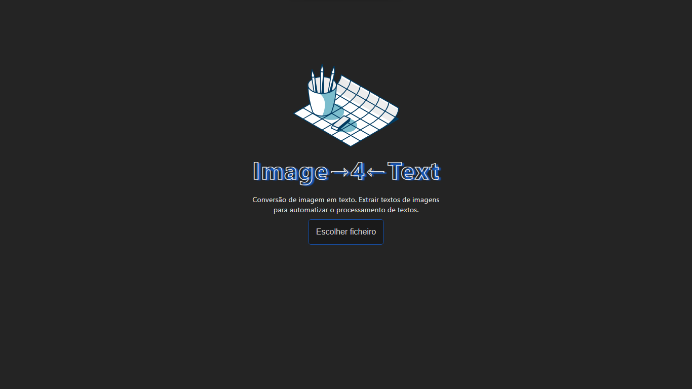

<h1 align="center">
  📸📝 Image 4 Text
</h1>
`Conversão de imagem em texto. Extrair textos de imagens para automatizar o processamento de textos.`

<h4 align="center"><a href="https://image4text.vercel.app/">Clique para visitar o projeto</a></h4>

---

## 💼 Tecnologias utilizadas

Para o desenvolvimento deste site utilizei as seguintes tecnologias:
- React.js
- TypeScript
- Vite
- Styled-Components
- Tesseract.js (OCR)

---

<h2>👨‍🚀 Autor</h2>

<table>
  <tr>
    <td>
      <a href="https://github.com/manuelbento19">
         
        
          <b>Manuel Bento</b>
        
      </a>
    </td>
  </tr>
</table>
